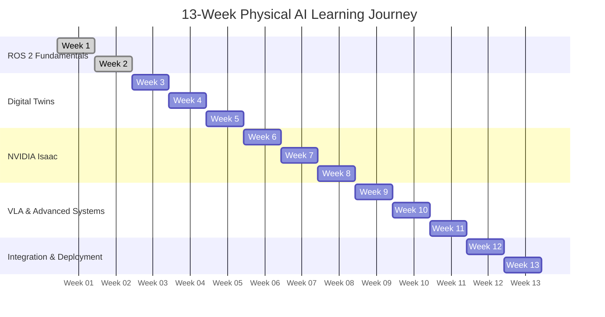

import HeroSection from '@site/src/components/HeroSection';

<HeroSection />

This is the beginning of your journey into the future of robotics...

## Why Physical AI Matters

Traditional AI operates in the digital realm, processing data and making decisions in virtual spaces. Physical AI, however, bridges the gap between digital intelligence and the physical world. It's the difference between analyzing video footage of a room and actually navigating through it, between predicting the best grip for an object and executing that grip with robotic hands.

Physical AI represents the next evolutionary step in artificial intelligence - where algorithms don't just think but act, where machine learning models don't just predict but physically interact with the world around them. This convergence of AI and robotics is unlocking unprecedented possibilities:

- **Real-world impact**: Moving beyond screens to tangible, physical outcomes
- **Embodied intelligence**: Learning through physical interaction and environmental feedback
- **Autonomous systems**: Creating robots that can operate independently in unstructured environments
- **Human-robot collaboration**: Developing systems that work alongside humans in natural ways

## The 13-Week Journey Ahead

This AI-native book is designed to take you from zero to running ROS 2 on a humanoid robot in just 13 weeks. Here's what you'll accomplish:

## Learning Outcomes Preview

By the end of this 13-week journey, you will:

- Master ROS 2 Humble Hawksbill for robot communication and control
- Build and simulate robots using NVIDIA Isaac Sim
- Develop vision-language-action (VLA) systems for advanced robot control
- Create digital twins that mirror real-world robotic systems
- Deploy autonomous behaviors on physical hardware
- Understand the complete pipeline from AI model to physical action

## For Every Skill Level

Whether you're an O/A-Level student just starting your journey into robotics or a professional looking to expand your expertise, this book adapts to your level. We've designed the content with zero friction for a motivated 16-year-old to get ROS 2 running, while providing the depth and technical rigor that professionals demand.

The learning path scales with you - from basic concepts to advanced implementations, from simulation to real hardware, from individual components to complete integrated systems.

## Your Professional, Exciting, Crystal-Clear Learning Experience

This isn't just another textbook. This is a living, breathing guide to the future of robotics, written with slight irreverent humor to keep things engaging without sacrificing technical accuracy. We'll tackle the complex topics with the clarity they deserve, ensuring you understand not just what to do but why you're doing it.

Ready to begin your journey into Physical AI? Let's dive in and start building the future of robotics together.

import NextSteps from '@site/src/components/NextSteps';

## Next Steps

<NextSteps />