# Isaac Platform Architecture Overview Diagram

```mermaid
graph TB
    subgraph "Isaac Platform Core"
        A[Isaac SDK] --> B[Core Libraries]
        A --> C[Development Tools]
        A --> D[Simulation Framework]

        B --> B1[Isaac Core]
        B --> B2[Isaac Apps]
        B --> B3[Isaac Messages]
        B --> B4[Isaac Utils]

        C --> C1[Isaac Sight]
        C --> C2[Isaac Create]
        C --> C3[Isaac Build]
        C --> C4[Isaac Launch]

        D --> D1[Isaac Sim]
        D --> D2[Isaac Gym]
        D --> D3[Isaac Navigation]
        D --> D4[Isaac Manipulation]
    end

    subgraph "AI Components"
        E[AI Integration] --> F[Perception Systems]
        E --> G[Control Systems]
        E --> H[Learning Systems]

        F --> F1[Computer Vision]
        F --> F2[Sensor Processing]
        F --> F3[Object Detection]

        G --> G1[Path Planning]
        G --> G2[Motor Control]
        G --> G3[Balance Control]

        H --> H1[Reinforcement Learning]
        H --> H2[Imitation Learning]
        H --> H3[Transfer Learning]
    end

    subgraph "Humanoid Applications"
        I[Humanoid Robotics] --> J[Locomotion Control]
        I --> K[Manipulation Control]
        I --> L[Human-Robot Interaction]

        J --> J1[Bipedal Walking]
        J --> J2[Balance Maintenance]
        J --> J3[Terrain Adaptation]

        K --> K1[Grasp Planning]
        K --> K2[Force Control]
        K --> K3[Tool Usage]

        L --> L1[Gesture Recognition]
        L --> L2[Voice Interaction]
        L --> L3[Social Behavior]
    end

    B1 --> F1
    B2 --> G1
    D1 --> H1
    F --> I
    G --> I
    H --> I
```

## Description

This diagram illustrates the overall architecture of the NVIDIA Isaac Platform, showing the core components and their relationships:

### Isaac Platform Core
- **Isaac SDK**: The main software development kit containing core libraries, development tools, and simulation framework
- **Core Libraries**: Fundamental components including Isaac Core (message passing, lifecycle management), Isaac Apps (application framework), Isaac Messages (inter-component communication), and Isaac Utils (utility functions)
- **Development Tools**: Tools for development including Isaac Sight (visualization), Isaac Create (project creation), Isaac Build (compilation), and Isaac Launch (execution management)
- **Simulation Framework**: Components for simulation including Isaac Sim (physics simulation), Isaac Gym (reinforcement learning), Isaac Navigation (path planning), and Isaac Manipulation (grasping and manipulation)

### AI Components
- **Perception Systems**: AI-powered perception capabilities including computer vision, sensor processing, and object detection
- **Control Systems**: AI-powered control systems for path planning, motor control, and balance control
- **Learning Systems**: AI learning systems for reinforcement learning, imitation learning, and transfer learning

### Humanoid Applications
- **Locomotion Control**: Systems for controlling robot movement including bipedal walking, balance maintenance, and terrain adaptation
- **Manipulation Control**: Systems for controlling robot manipulation including grasp planning, force control, and tool usage
- **Human-Robot Interaction**: Systems for enabling interaction between humans and robots including gesture recognition, voice interaction, and social behavior

The connections between components show how the core platform components integrate with AI systems to enable humanoid robotics applications.