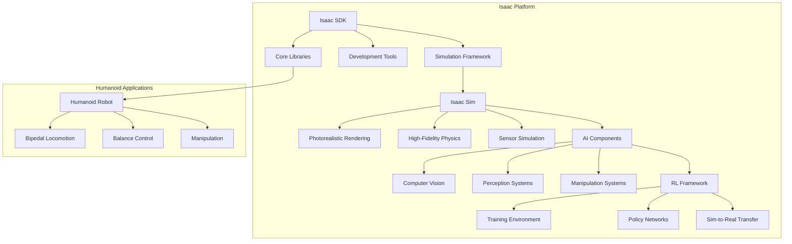

# Isaac Platform Architecture Diagram

## Diagram Description

This diagram illustrates the key components of the NVIDIA Isaac Platform and their relationships to humanoid robotics applications:

1. **Isaac SDK**: The core software development kit containing:
   - Core Libraries: Fundamental robotics capabilities
   - Development Tools: Tools for building and debugging applications
   - Simulation Framework: Integration with simulation environments

2. **Isaac Sim**: The photorealistic simulation environment with:
   - Photorealistic Rendering: High-quality visual simulation
   - High-Fidelity Physics: Accurate physics simulation
   - Sensor Simulation: Realistic simulation of various sensors

3. **AI Components**: AI-powered systems including:
   - Computer Vision: Visual perception capabilities
   - Perception Systems: Environmental understanding
   - Manipulation Systems: Object interaction capabilities

4. **RL Framework**: Reinforcement learning components:
   - Training Environment: RL training infrastructure
   - Policy Networks: Learned control policies
   - Sim-to-Real Transfer: Techniques for real-world deployment

5. **Humanoid Applications**: Specific applications for humanoid robots:
   - Bipedal Locomotion: Walking and movement
   - Balance Control: Maintaining stability
   - Manipulation: Object interaction