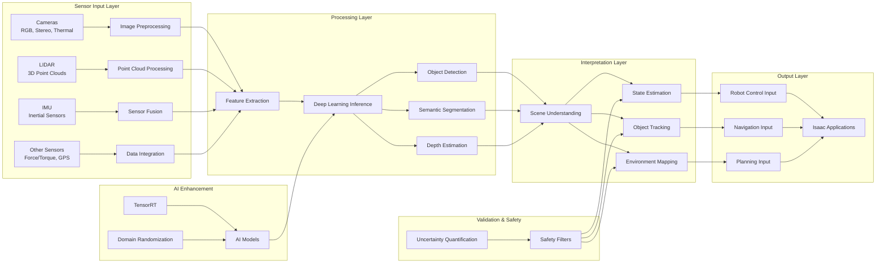

# Isaac Perception Pipeline Diagram

## Description

This diagram illustrates the Isaac perception pipeline from sensor input to robot control output:

### Sensor Input Layer
- **Cameras**: RGB, stereo, and thermal cameras providing visual information
- **LIDAR**: 3D point cloud data for spatial understanding
- **IMU**: Inertial measurement units providing motion and orientation data
- **Other Sensors**: Additional sensors including force/torque sensors and GPS

### Processing Layer
- **Preprocessing**: Initial processing of raw sensor data including noise reduction, calibration, and normalization
- **Feature Extraction**: Identification of meaningful features from sensor data
- **Deep Learning Inference**: Application of AI models for perception tasks
- **Specialized Processing**: Specific processing for object detection, segmentation, and depth estimation

### Interpretation Layer
- **Scene Understanding**: Higher-level interpretation of the environment
- **State Estimation**: Estimation of robot and object states
- **Object Tracking**: Continuous tracking of objects in the environment
- **Environment Mapping**: Creation of maps of the environment

### Output Layer
- **Robot Control Input**: Information for robot control systems
- **Navigation Input**: Information for navigation systems
- **Planning Input**: Information for motion planning systems
- **Isaac Applications**: Integration with Isaac applications framework

### AI Enhancement
- **AI Models**: Deep learning models for perception tasks
- **TensorRT**: NVIDIA's inference optimizer for GPU acceleration
- **Domain Randomization**: Techniques for improving real-world transfer

### Validation & Safety
- **Safety Filters**: Safety checks to ensure perception outputs are safe
- **Uncertainty Quantification**: Assessment of uncertainty in perception results